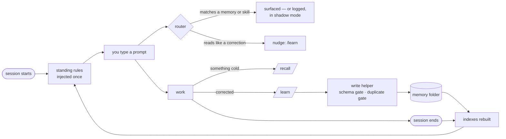

# raememberit

**Memory for Claude Code that survives the session.** Plain markdown, no database, one command.

[](https://github.com/kevmonzon/raememberit/actions/workflows/ci.yml)


Claude Code forgets everything when a session ends. raememberit gives it a memory folder you own —
standing rules it reads every time, project notes it looks up when a task touches them, and a log of
every session — with hooks that make capturing a fact involuntary and looking one up reflexive.

- **Two tiers, one budget.** Standing rules are injected once per context; everything else is a
  one-line pointer pulled in only when a topic arises. The always-on tier has a byte budget and a
  tripwire, because context is the scarcest resource here.
- **Capture is enforced, not requested.** A correction-shaped prompt gets a nudge. A write goes
  through a helper that refuses a memory without a description, a rule without its incident, or a
  near-duplicate of one that exists.
- **Retrieval does not depend on remembering to retrieve.** A router scores every prompt against
  your memories and your installed skills — quietly logging until you have seen its precision, then
  surfacing them.
- **Nothing to run.** No daemon, no vector store, no service. The folder survives a `cp -r`, and
  every index is regenerated from the files.

## Install

```bash
git clone https://github.com/kevmonzon/raememberit.git
cd raememberit
./raememberit install
```

It looks at your computer, asks what Claude should call you, shows what it is about to do, and does
it after you say yes. Two minutes later you have made a memory in one session and found it in the
next. **[Getting started →](docs/getting-started.md)**

Requires Claude Code, `git`, `jq`, `python3`. macOS or Linux.

## Use it

| | |
|---|---|
| `/recall <topic>` | before investigating anything cold — a repo, a ticket, an error, a tool |
| `/learn` | the moment you are corrected, or a fact costs real effort |
| `./raememberit status` | is it installed, is it current, is anything wrong |
| `./raememberit update` | after `git pull` — shows what will change, then what changed |
| `./raememberit uninstall` | removes the tools; your memories stay, in plain text |

The rest runs on its own. What little does not, and how often, is on one page:
**[Cadence →](docs/cadence.md)**

## How it works



Three diagrams — a session, a memory's life, the loop between sessions — and the reasoning behind
each part: **[How it works →](docs/how-it-works.md)**

## Documentation

| | |
|---|---|
| [Getting started](docs/getting-started.md) | install, the first ten minutes, the two habits |
| [How it works](docs/how-it-works.md) | the diagrams, the two tiers, the write path |
| [Cadence](docs/cadence.md) | what runs by itself, what you run, and when |
| [Commands and hooks](docs/commands.md) | the five commands and the twelve hooks |
| [Configuration](docs/configuration.md) | every knob, tiering, domain tags, the router's modes |
| [Upgrading](docs/upgrading.md) | what an update touches and what it never does; uninstall |
| [Troubleshooting](docs/troubleshooting.md) | each warning `status` can show, and its fix |
| [Advanced](docs/advanced.md) | the three install routes, every flag, where the corpus lives |
| [Development](docs/development.md) | the test suites, the sanitization gate, building the plugin |
| [Internals](docs/internals.md) | the lifecycle stage by stage, and every piece of state |

## Status

Alpha. Extracted from one engineer's daily setup and generalized; installable with one command,
465 assertions green on every push, and the update path measured rather than promised. The
prompt-time router ships in shadow mode until its precision has been measured on your corpus.

## Contributing

`tools/test-all.sh` before a commit; the sanitization gate runs as the pre-commit hook. A fix lands
with its failing test first. [Development →](docs/development.md)

## License

MIT — see [`LICENSE`](LICENSE).
