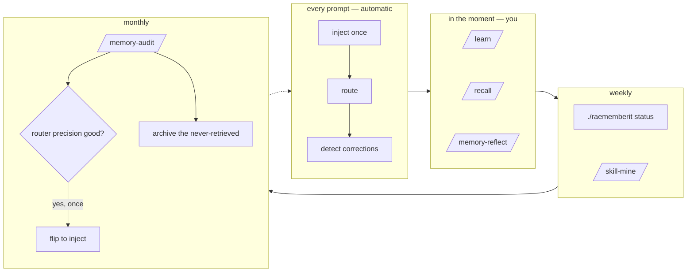

# Cadence — what runs by itself, and what you run

Most of the discipline is involuntary: hooks do it. What remains is a handful of things you run,
each on a rhythm. This page is the whole list.

## Automatic — every session, nothing to run

| When | What happens | Run by |
|---|---|---|
| session start | the write helper is placed at a stable path (plugin route); the truncation tripwire checks whether recent injections actually arrived; a pattern sweep is *offered* if enough logs have piled up | `SessionStart` hooks |
| every new context | the always-on index (your standing rules and the last few sessions) is injected once, then suppressed until the context resets | `inject-memory.sh` |
| every prompt | the router scores the prompt against your catalog and your installed skills — in `shadow` mode it logs what it would have surfaced; in `inject` mode it surfaces it | `context-router.sh` |
| a prompt that reads like a correction | logged, and one line of context names `/learn` | `correction-nudge.sh` |
| before compaction | a reminder to capture memory before the context compresses | `precompact-notice.sh` |
| every turn end | a reminder if today has no session log; a reminder if two corrections produced no feedback memory | `require-log.sh`, `learn-nag.sh` |
| session end | both indexes regenerated from the files, in the background | `rebuild-index-hook.sh` |

## You, in the moment

| When | What | Why it cannot wait |
|---|---|---|
| the moment you are corrected, or a fact costs real effort | `/learn` | the sentence that corrected you is exact now and a summary by evening. The correction hook reminds you; it cannot write the rule for you. |
| before investigating anything cold — a repo, a ticket, an error string, a tool | `/recall <topic>` | the working assumption is that a memory exists until the catalog says otherwise. The router does the first sweep automatically once you flip it to `inject`. |
| the end of a session, or when the pre-compaction reminder appears | `/memory-reflect` | the interaction log is the only record of the narrative; if `/learn` has been doing its job, this is boring, which is the point |

## You, on a rhythm

| Rhythm | What | Command |
|---|---|---|
| after every `git pull` of this repo | see what would change, then update | `./raememberit update` |
| weekly | a health check in plain words | `./raememberit status` |
| when the start-of-session offer appears (every 15 new logs by default) | mine the recent logs for patterns worth promoting into a skill; every candidate needs your yes | `/skill-mine` |
| monthly | the read-only audit: delivery, duplicates, contradictions, finished work still marked live, retrieval usage, the archive shortlist | `/memory-audit` |
| once, after a week or two in shadow mode | sample the router's log, judge its hits, and flip it to `inject` if the ratio earns it | `/memory-audit` §7, then set `RAEMEMBERIT_AUTORECALL=inject` |
| whenever you edit a memory by hand | regenerate the indexes — they are derived, never hand-edited | `bash <config>/raememberit/engine/rebuild-index.sh` |
| when the tripwire or `status` says the always-on tier is over budget | demote craft rules with `scope: domain` until it fits | edit frontmatter, then rebuild |

## The rhythm as a picture

## What nobody has to do

- **Rebuild indexes after `/learn`.** The write helper does it.
- **Clean up duplicates later.** The write refuses to leave one behind.
- **Remember the hooks exist.** They are one line each in `<config>/CLAUDE.md`'s imported note, and
  `status` lists them.
- **Trim the always-on tier by hand on a schedule.** The tripwire tells you when it stopped
  arriving, and the budget verdict tells you before.
