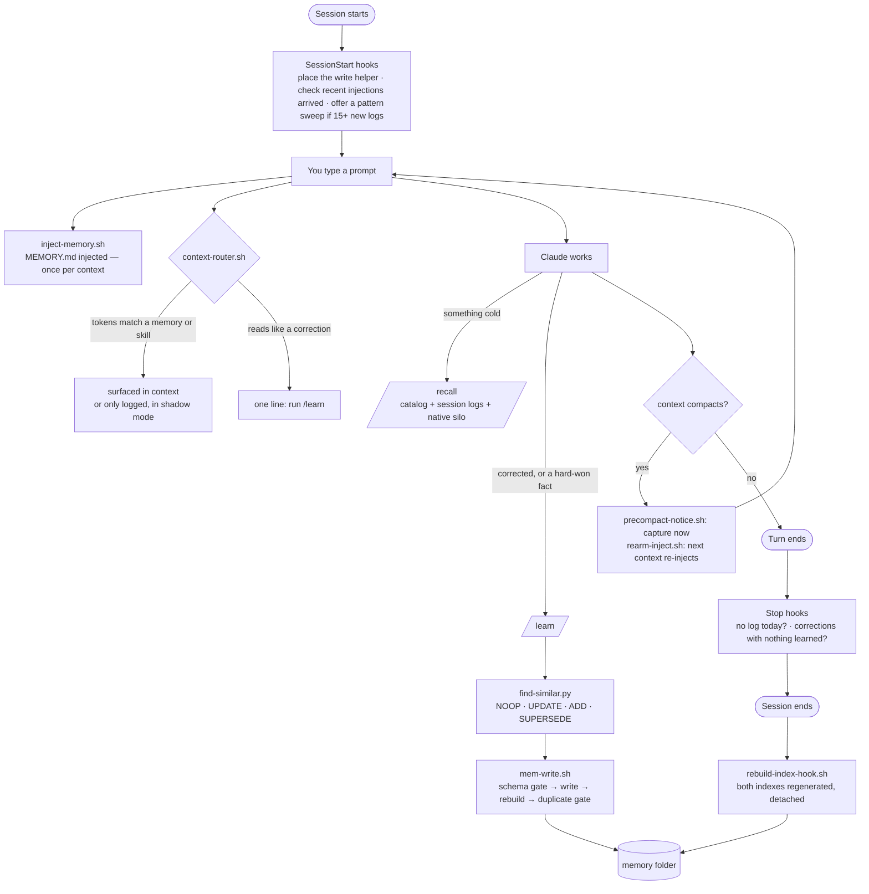
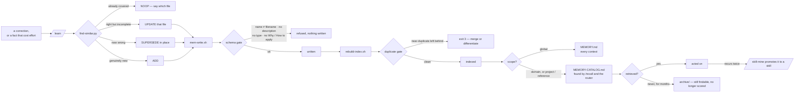
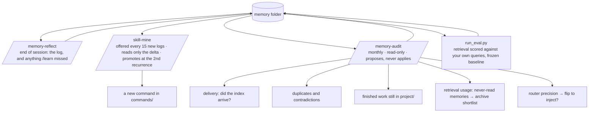

# How it works

Three loops, one folder of markdown. Everything below is derived from the files in `<config>/memory`;
there is no database, no vector store and no daemon, and the whole thing survives a `cp -r`.

## The folder

```
<config>/memory/
├── MEMORY.md           always-on index — injected once per context     (generated)
├── MEMORY-CATALOG.md   on-demand index — read by /recall               (generated)
├── user_profile.md     who you are, how to address you
├── feedback/           standing rules: how Claude should work           ← the always-on tier
├── project/            state of ongoing work not derivable from code   ← on demand
├── reference/          facts and pointers about external systems       ← on demand
├── interactions/       one log per session, YYYY-MM-DD-HH-MM-topic.md  ← on demand
├── archive/            finished work, kept for the record              ← on demand
└── eval/queries.json   the lookups you actually make, scored by the eval harness
```

Two tiers, because context injected into every prompt is the scarcest resource in the system:

| Tier | File | Carries | Cost |
|---|---|---|---|
| **always-on** | `MEMORY.md` | your profile, every `feedback/` rule with `scope: global`, the newest eight session logs | paid once per context window, every session |
| **on-demand** | `MEMORY-CATALOG.md` | every other memory as a one-line pointer, plus Claude Code's own per-project auto-memory | paid only when `/recall` or the router reads it |

## A session



Injection is once per **context window**, not once per prompt: a guard file keyed on the session id
is created on the first injection and removed only by the compaction and session-end hooks, so a
fresh context re-injects without a cron or a timestamp heuristic.

## A memory's life



The write path is a script, not the editor tool, for a hard reason: Claude Code treats any path
inside a `.claude` directory as a sensitive file and refuses its Edit and Write tools there per file,
and no permission rule overrides that. Bash is not gated, so `mem-write.sh` is the door — and a door
can enforce a schema, which the editor never could. [Advanced](advanced.md#where-the-corpus-lives)
has the measurements.

## Between sessions — the outer loop



`/memory-audit` writes nothing. Every check in it exists because it once found a real defect that
no retrieval improvement could have fixed — the worst being three files describing one fact within
four hours, and two thirds of `project/` describing work that had already shipped.

## Why the router is quiet by default

`context-router.sh` scores every prompt against the catalog and the installed skills with no model
call. Both halves start in **shadow** mode: they write what they *would* have surfaced to
`.recall-log` and `.skill-log` and inject nothing. Injection is the scarce resource, and a hook that
injects before its precision is measured is the always-on tier growing by another door. Run it for a
week, let the audit sample the log, then flip it with the number in hand — [Configuration](configuration.md#the-router).

## The one failure that looks like success

Past an undocumented size ceiling the harness does not inject a hook's context: it writes the payload
to a file, hands the model a short preview and a path, and reports no error. An always-on tier that
grew past that ceiling stopped being delivered while every test stayed green — measured on a real
corpus, thirteen sessions received eight of seventy-one entries. Three things guard it now: a byte
budget on the tier with a verdict in `.index-status`, a `SessionStart` tripwire that detects the
artifacts the harness itself leaves, and `scope: domain` to demote the rules that do not need to be
in front of Claude before it knows what the task is.
